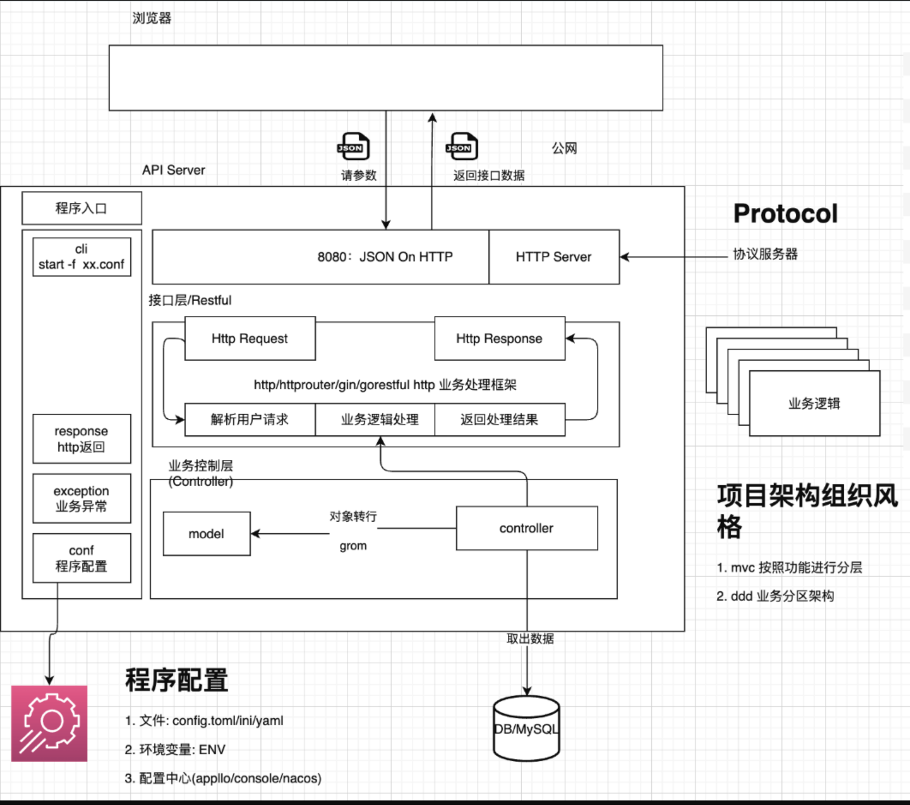

# Go-18

课件地址https://gitee.com/infraboard/go-course/blob/master/v2.md
# 开发语言
1. 无数据结构解释型：Bash
   - 只能做简单任务，不适合做API集成，工作中的提效工具
2. 动态解释型：脚本执行引擎（解释器）：PHP、Python、Javascript、Lua、Perl、Ruby
   - 动态语言不适合做大型程序，因为不安全
   - 可以做项目，逻辑简单的小型项目，简单API任务的处理 
3. 静态解释型：大型运行时：Java、C#
   - 可以做大型项目（主流开发语言，生态成熟）
4. 静态编译型（不带gc）：C、C++、Zig、Rust、Swift
5. 静态编译型（带gc）：Go

程序设计
1. 需求收集，具体问题分析，给出具体的解法
2. 问题抽象，建立这类问题的通用解决模型（程序设计）
   - 应用程序部署问题
      - 标准化部署如何做？
      - 非标准化部署如何适配？
      - 有没有其他部署方式？
   - 需不需要做拓展流程？
3. 架构与实现

## 关于项目、项目课的整体介绍（16天）

+ Book Api Server
+ 用户中心
+ 用户中心
+ 应用中心 
+ 审计中心 
+ 资源中心（CMDB）
+ 发布中心 
+ 应用流水线

## 项目课要求及注意事项

项目课的环境：Mac/Linux，Windows
+ Go 1.24.1及以上
+ goland/vscode

注意事项
+ 不要copy代码，代码要自己写。如何学会排查问题，才是开发的起步
+ 转变思维，不怕报错，认真查看报错原因，结合AI工具帮忙分析（程序一次写完能正常运行是巧合，一运行就报错才是正常情况）
+ 持之以恒，每天都写一点，如果时间不过，写一个函数或者少写也行，程序开发是一个吃熟练度的工作，需要大量练习
+ 项目里面 添加自己的文档和思考，也会查阅周边资料，都是回顾的重要途径

仓库使用方式
+ 每一小节 打一个tag，根据tag来看 视频章节的代码
+ 可以随时浏览 项目代码，加深理解
+ 对于自己的项目，就一个项目对应一个仓库，这也是企业里面的主流方式

整个Go18是一个工程，里面示例代码分为多模块
```sh
# 使用后这个包就能直接被外部通过import访问
go mod init "10.120.10.150/go-course/go18"

# 这样就不行
go mod init "go18"
```

## Gin + Gorm 开发简单的Book API Server

从写脚本开始 与 学会合理使用包来组织你的项目工程
    - RESTful API：一种API风格（可以按照风格，也可以不按照风格）
    - URI：针对开发者而言，开发时的路径对应着何种处理函数，这个路径就称为URI（开发者定义的访问路径）
        - 约定使用资源名称应为该名称的复数
        - 可以加入一些动词达到见名知意的效果
        



