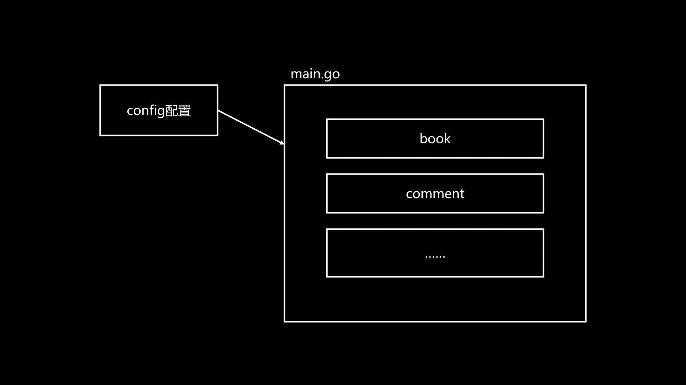

# mvc 功能分层架构

v2中独立出了config包和main包，main包依赖config包的配置（配置信息被剥离出main包）
随着业务越来越多，放在main包就不好维护
就需要引出功能（业务）分层架构：按照不同的功能模块拆分成不同的包，然后在main的入口把它们组装起来，这也是通常的大型程序的目录组织结构 

- Model模型层（数据的定义）
  - 专门定义结构体，即要放在数据库里的对象
  - 想要功能职能再清晰点，就把所有跟数据库相关的、数据模型的定义都放在里面
  - 没有独特的逻辑，只有对结构体的定义，但是这直接决定了数据库表结构 
- view视图层、接口层（数据的返回）
  - 如果是网页，视图层放的就是HTML代码
  - 如果是API服务，视图层放到就是Json格式的字符串（主流）
- controller控制（器）层（数据的处理）
  - 把数据处理独立出来，利于相互引用