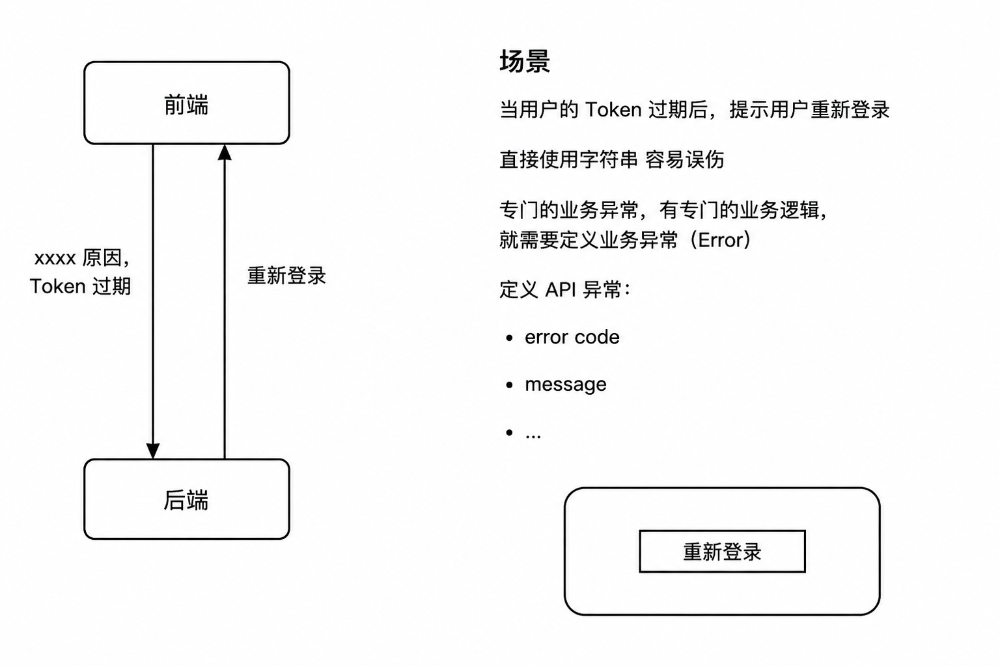

# 业务异常

# API异常的使用场景

## API异常定义（自定义API异常）
例如
- 用户名或密码不正确
- 用户不存在
- Token过期



异常的定义
```go
type ApiException struct {
	// 自定义业务异常的编码，50001 表示Token过期
	Code int `json:"code"`
	// 异常的描述信息
	Message string `json:"message"`
	// 不会出现在Body里面，序列化成Json，HTTP response 进行set
	HttpCode int `json:"-"`
}

func (e *ApiException) Error() string {
	return e.Message
}
```

异常的比对，对于Error Code 更准确
```go
// IsApiException 通过Code来比较错误
func IsApiException(err error, code int) bool {
	var apiErr *ApiException
	if errors.As(err, &apiErr) {
		return apiErr.Code == code
	}
	return false
}
```

内置了一些全局异常，方便快速使用
```go
func ErrServerInternal(format string, a ...any) *ApiException {
	return &ApiException{
		Code:     CODE_SERVER_ERROR,
		Message:  fmt.Sprintf(format, a...),
		HttpCode: 500,
	}
}

func ErrNotFound(format string, a ...any) *ApiException {
	return &ApiException{
		Code:     CODE_NOT_FOUND,
		Message:  fmt.Sprintf(format, a...),
		HttpCode: 404,
	}
}

func ErrValidateFailed(format string, a ...any) *ApiException {
	return &ApiException{
		Code:     CODE_PARAM_INVALIDATE,
		Message:  fmt.Sprintf(format, a...),
		HttpCode: 400,
	}
}
```

## 返回异常

```go
	err := config.DB().Where("id = ?", in.BookNumber).Take(bookInstance).Error
	if err != nil {
		if err == gorm.ErrRecordNotFound {
			return nil, exception.ErrNotFound("book %d not found", in.BookNumber)
		}
		return nil, err
	}
```

## 断言自定义异常
```go
	if exception.IsApiException(err, exception.CODE_NOT_FOUND) {
	    // 异常处理逻辑代码
	}
```