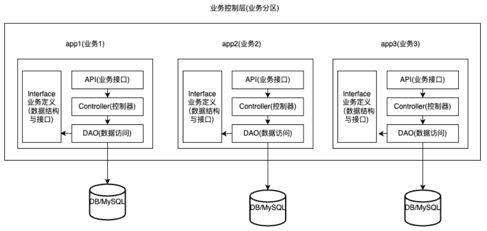

# 业务分区架构（基于mcube）

mcube 与 Ioc

更新部分：
1. 单元测试 支持通过环境变量注入，优化单元测试配置，共用一套配置
2. 新增Book Api项目，从简单的脚本开发 -> 配置分离 -> mcv模式 -> ioc 业务分区 经历4个版本，讲解如何开发复杂项目
3. Vblog项目 新增部署，支持2种部署模式：前后端分离部署 与 前后端打包一体的部署
4. 优化其他几个项目，支持 可以通过import的方式，快速使用
5. cmdb 云商凭证 支持加密存储

## 业务分区第一步 定义业务（RPC）

1. 当前项目有：Book（书籍管理）和 Comment（评论管理），需要分析出这写义务模块提供的功能
2. 建立apps文件夹，文件夹里放业务二级文件夹
