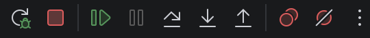

# 单元测试

目的：测试目标函数的功能是否正常


## 构建集成单元测试

目标函数：Add
站在使用者的角度进行单元测试：调用unittest.Add(1, 2) == 3。断言验证是否==3

需要使用专门的包：在同一个目录下面，允许有两个包，一个包为正常开发包（普通包）和一个单元测试包（test包）

test包要求：
1. 单元测试包的文件名称：xxx_test.go，必须以_test结尾，才是一个合格的单元测试包
2. 必须是xxx_test包名

## 编写单元测试代码：Add（run_test）

1. 单元测试函数 必须以test打头
```go
// 针对Add函数的单元测试
func TestAdd(t *testing.T) {
	// 只想运行一下
	// 对单元log进行配置，打印单元测试的日志
	// 如果没有打印日志，配置VsCode打印单元格的测试日志：-v -count=1
	t.Log(unittest.Add(1, 2))

	// 通过程序断言来判断
	if unittest.Add(1, 2) != 3 {
		t.Fatal("1 + 2 != 3")
	}
	
	// 专门的断言库，可以根据实际逻辑继续使用if-else嵌套
	should := assert.New(t)
	should.Equal(3, unittest.Add(1, 2))
}
```

## 单元测试调试

1. 需要加断点，必须加在有代码的位置，可以加在受影响的任何一行代码
2. 操作栏
   1. Continue恢复程序：继续，从当前断点继续到下一个断点，如果没有就是跑完了
   2. Step Over步过：下一步，下一行
   3. Step In步入：进入到这行里面的执行逻辑
   4. Step Out步出：从这行的执行路径里出来

## 单元测试配置

单元测试如何读取外部配置，IDE帮执行CLI

告诉IDE，读取单元测试的配置
1. 直接注入环境变量
```json
{
    "go.testEnvVars": {
        "CONFIG_PATH": "application.yaml"
    }
}
```
2. 将环境变量写入到一个文件中，让IDE读取
```json
{
    "go.testEnvFile": "${workspaceFolder}/etc/unit_test.env"
}
```